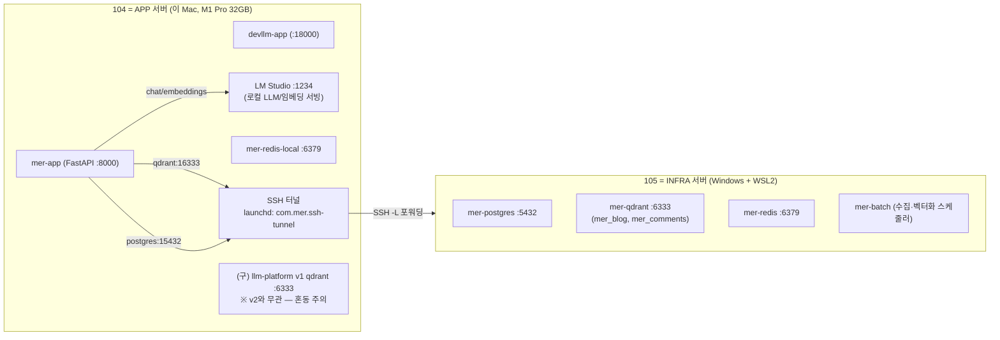
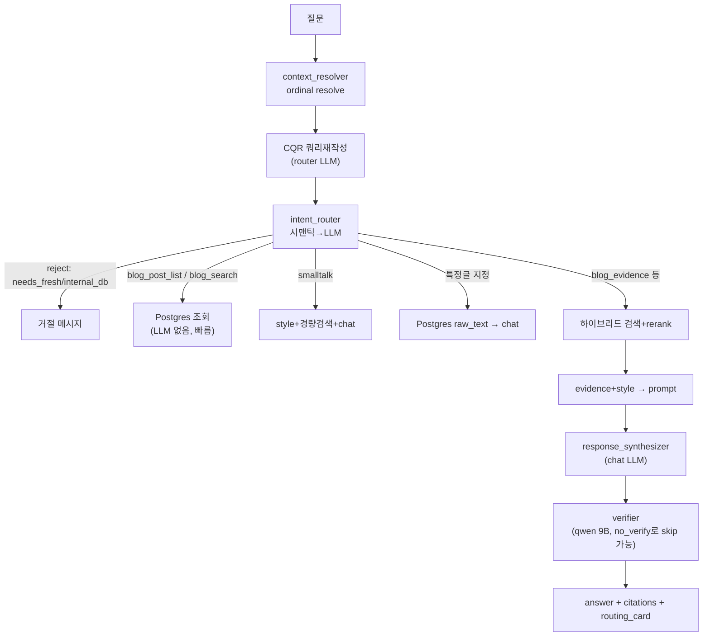

# llm-platform-v2 아키텍처 개요

> 이 폴더는 "우리 앱 전체 구조"를 빠르게 다시 떠올리기 위한 살아있는 참조 문서다.
> 코드/인프라가 바뀌면 여기도 갱신한다. 최종 갱신: 2026-06-06

## 0. 한 줄 요약

메르 블로그 기반 RAG QA 플랫폼(v2). 앞으로 **범용 로컬 LLM 게이트웨이**로 확장 중
(분류기 → capability 라우팅 → 도구 실행 → 답변 합성). 댓글필터 등 외부 클라이언트가 호출한다.

## 1. 물리 토폴로지 (서버 2대)



- **104 (APP, 이 Mac)**: FastAPI 앱(`mer-app`), LM Studio(로컬 LLM·임베딩), 로컬 Redis.
- **105 (INFRA, Windows+WSL2)**: Postgres, Qdrant, Redis, 수집/벡터화 배치(`mer-batch`).
- **연결**: 104 → 105 는 **상시 SSH 터널**. 105의 `5432/6333/6379` → 104 로컬 `15432/16333/16379`.
  - 터널은 launchd `com.mer.ssh-tunnel` 가 관리(`KeepAlive`, `RunAtLoad`).
  - app 컨테이너는 `postgres`,`qdrant` 호스트명을 `host-gateway`(=Mac 터널 포트)로 매핑.

> ⚠️ **단일 장애점(SPOF)**: 105가 Windows라 **WSL/Docker가 떠 있어야만** 인프라가 동작.
> WSL은 attach된 클라이언트가 없으면 idle-timeout으로 VM째 셧다운됨. 자세한 복구 절차는 [infra-recovery.md](./infra-recovery.md).

## 2. LLM 모델 구성 (LM Studio :1234, 104)

| 역할(task) | 모델 | 비고 |
|---|---|---|
| chat (답변 합성) | `google/gemma-4-e4b` | 메인 생성 |
| router (분류/CQR) | `qwen3.5-4b-claude-4.6-opus-reasoning-distilled` | ⚠️ **reasoning 모델** — 분류에 11~22초 소모 |
| verifier | `qwen/qwen3.5-9b` | 답변 entailment 검증 |
| embedding | `text-embedding-bge-m3` (1024d) | 검색·시맨틱 라우팅 |
| reranker | `BAAI/bge-reranker-v2-m3` (CrossEncoder, 앱 내 로드) | + TEI 리랭커 컨테이너 존재 |

추가 사용 가능 모델(미사용): `qwen2.5-1.5b-instruct`, `qwen2.5-0.5b-instruct`, `selene-1-mini-llama-3.1-8b`.

> 모델 라우팅은 `app/shared/llm/lmstudio.py:build_llm(task=...)`.
> ⚠️ task별 모델이 달라 LM Studio가 요청마다 **모델 스왑(디스크 재로딩)** → 큰 지연.

## 3. 애플리케이션 구조 (`app/`)

```
app/
  mer_persona/
    main.py            FastAPI 엔트리, lifespan(시맨틱 라우터·리랭커 warm-up)
    routers/
      mer_answer.py    ★ POST /v1/mer/answer (메인 RAG 파이프라인), /v1/mer/retrieve
      mer_chat.py      POST /v1/mer/chat (대화형)
      chat_ui.py       내장 채팅 UI
      ops.py           /ops/* 운영 엔드포인트
      debug.py         /v1/debug/*
    services/
      mer/
        intent_router.py     ★ 인텐트 분류 (시맨틱 임베딩 → LLM fallback)
        context_resolver.py  ordinal 참조 resolve, last_posts
        blog_post_query.py   글 목록/검색 (Postgres, LLM 불필요)
        evidence_builder.py  검색 노드 → evidence/citations
        prompt_builder.py    system/user 프롬프트 빌드
        style_pack_builder.py 메르 말투 few-shot (mer_style 컬렉션) ※ 현재 누락
        verifier.py          답변 entailment 검증
        response_synthesizer.py 최종 생성 호출
      retrieval/
        hybrid_retriever.py  vector + BM25 + 댓글 하이브리드
        query_rewriter.py    쿼리 재작성 + CQR(대화 맥락)
        reranker.py          CrossEncoder 재랭킹
      index/
        vector_index.py      Qdrant 벡터 retriever
        bm25_index.py        BM25 (pickle 영속화)
  shared/
    llm/lmstudio.py    build_llm(task), build_embed_model
    db/                SQLAlchemy 모델/세션 (Postgres)
    cache/redis_client.py
batch/                 수집·임베딩 배치 (105 mer-batch에서 실행)
infra/migrations/      SQL 마이그레이션
deploy/                Dockerfile, compose.{app,infra,batch,dev,observability}.yml, env/
```

## 4. 답변 파이프라인 (`POST /v1/mer/answer`)



엔드포인트 요약:
- `POST /v1/mer/answer` — 메인 RAG 답변
- `POST /v1/mer/retrieve` — 검색 결과만(디버그, LLM 없음)
- `POST /v1/mer/chat` — 대화형
- `GET /healthz`, `/version`, `/metrics`
- `/ops/*`, `/v1/debug/*`

## 5. 향후 방향 — Retrieval/Search 계층 (Codex 작업 중)

신규 `/v1/search/*` (옵시디언 `2026-06-06 Retrieval Agent 검색 API 계획` 참고):
- `[LLM] Planner/Retrieval Agent` → 도구 선택(web/market/file/rag)
- `[LLM 불필요] Search Tools` → 실제 검색 실행 (개별 테스트 가능)
- `[LLM] Answer Synthesizer` → 결과 종합
- bounded loop (max_steps=3, timeout 제한)

**진행 중 설계(이 문서 외 spec)**: 그 앞단의 "빠르고 고품질 분류기"(capability 라우터).
LM Studio 모델 스왑/ reasoning 분류 지연을 없애기 위해 llama.cpp 상주 + grammar 제약 분류 방향 검토 중.

## 6. 현재 알려진 갭 (2026-06-06)

- ⚠️ 105 WSL/Docker가 idle 시 셧다운 → 인프라 전체 중단(SPOF). 영구 fix는 105 Windows 설정 필요.
- ⚠️ `mer_style` Qdrant 컬렉션 404 → 스타일 few-shot 동작 안 함.
- ⚠️ BM25 pickle(`mer_blog`) not found 경고 → 하이브리드에서 BM25 미동작.
- ⚠️ 분류기가 reasoning 모델 → 분류 1회 11~22초.
- ⚠️ 답변 1건 ~111초(verifier 끈 상태) — 주범은 모델 스왑+생성(~90초).
- ℹ️ 로컬 Mac의 v1 `qdrant`(:6333)는 별개 구프로젝트 — 삭제 시 v1 데이터 소실 주의.
